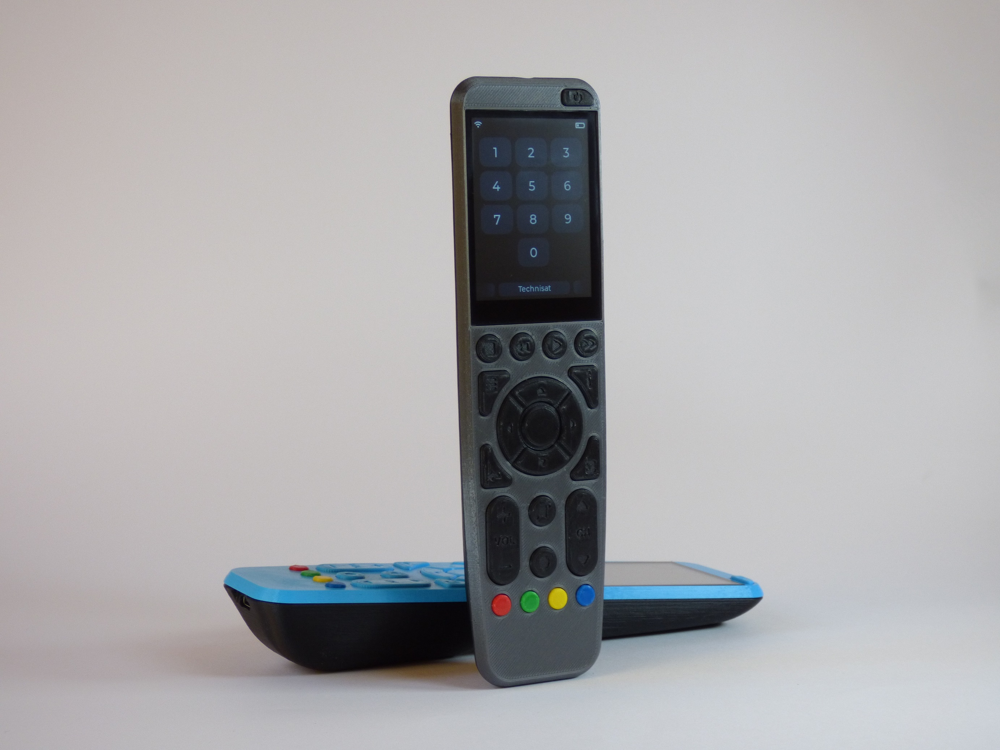
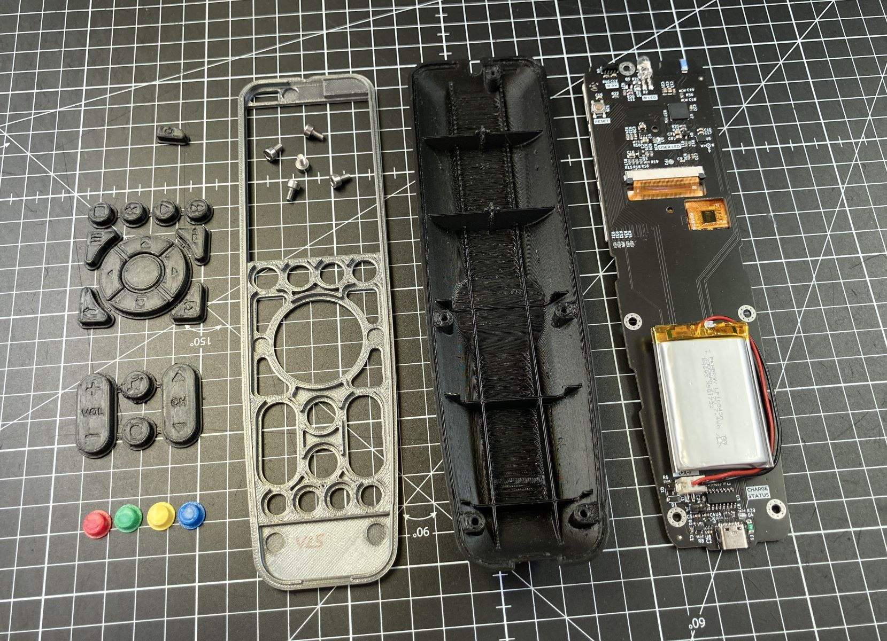

# OMOTE - Open Universal Remote

## Overview

OMOTE is an ESP32 based open source universal remote. Its capacitive 2.8” touchscreen provides an intuitive and snappy user interface for switching devices and settings. No hub or docking station is required as the remote features infrared, Wi-Fi and Bluetooth connectivity. With its well optimized power consumption, OMOTE can run for months on a charge. And since the design files are open source, you can fully customize them to your devices and needs.

  

### Features
* 2.8” 320x240px capacitive touchscreen
* Ergonomic, fully 3D printed case
* Responsive LVGL user interface
* Built in infrared, Wi-Fi and Bluetooth
* Press any button or simply lift the remote to wake it up
* Up to 6 months of battery life using a 2000 mAh Li-Po battery 

### Dependencies

* [espressif32](https://github.com/platformio/platform-espressif32)@^6.1.0
* [lvgl/lvgl](https://github.com/lvgl/lvgl)@^8.3.4
* [bodmer/TFT_eSPI](https://github.com/Bodmer/TFT_eSPI)@^2.5.23
* [sparkfun/SparkFun LIS3DH Arduino Library](https://github.com/sparkfun/SparkFun_LIS3DH_Arduino_Library)@^1.0.3
* [crankyoldgit/IRremoteESP8266](https://github.com/crankyoldgit/IRremoteESP8266)@^2.8.4
* [adafruit/Adafruit FT6206 Library](https://github.com/adafruit/Adafruit_FT6206_Library)@^1.0.6
* [knolleary/PubSubClient](https://github.com/knolleary/PubSubClient)@^2.8
* [Chris--A/Keypad](https://github.com/Chris--A/Keypad) (modified for inverted logic)

### The State of This Project

The hardware for OMOTE is designed to be easily replicated, using 3D-printed parts, a 2-layer PCB and commonly available components. The mechanical and PCB design can be considered mostly complete. Still, there might be areas for improvement, for example the IR range could be further optimized.

There is still a lot of work left to be done in terms of software. Right now, network settings, buttons and screen layouts are hard-coded. Controlling devices via MQTT is more of a tech demo at the moment and the network connection might not be perfectly reliable. Making the interface configurable, e.g. using a web interface, is a long-term goal. 

### To Do

Right now I have no idea if and when this will be done. But these would be the next steps:

- [ ] Easier configuration
    - [ ] Document the current process of custromization
    - [ ] Store the configuration in Flash (e.g. as a editable json file)
    - [ ] Add an interface for graphically editing the configuration
- [ ] Complete the on-device settings page
- [ ] Make the Wi-Fi connection more stable

See the [open issues](https://github.com/CoretechR/OMOTE/issues) and [discussions](https://github.com/CoretechR/OMOTE/discussions) for a full list of proposed features (and known issues).

## Getting Started

OMOTE might look like a finished product, but especially the software is ***not "consumer-friendly"*** yet. If you want to build your own remote and customize it to your devices, you should be ***somewhat experienced with electronics and programming***. 

### Simulator

You can try the user interface on your PC using the LVGL simulator. Just follow these steps:

1. Install Visual Studio, including the "Desktop development with C++" workload. You can use the free Community edition.
2. Start Visual Studio and open LVGL.Simulator.sln
3. Make sure that the build target is set to x64 and then run the local Windows debugger.

### Hardware

The central component of OMOTE is its PCB. If you want to build the PCB yourself, you will need SMT-reflow tools like a hot plate or a hot-air station. The 2-layered board and a solder paste stencil can be ordered from any PCB manufacturer using the [KiCad files](https://github.com/CoretechR/OMOTE/tree/main/PCB). Manufacturers like OSHPARK or Aisler will accept these files directly. For JLCPCB or PCBWay, you can use their plugin to export the optimized Gerber files.

I sourced the electrical parts from LCSC, but most of them should be available from the usual suppliers like Digikey or Mouser as well. You can check out the [BOM](https://github.com/CoretechR/OMOTE/blob/main/PCB/BOM.csv) for all the necessary components.

  

The [housing and buttons](https://github.com/CoretechR/OMOTE/tree/main/CAD) can be printed using PLA or PETG. I sliced the models with PrusaSlicer with a layer height of 0.25mm and printed them using ColorFabb PETG. It is important that the case part is printed with its flat side towards the print bed using lots of support structures. If your printer is well calibrated, the cover plate will snap onto the case.

### Software

The remote can be charged and programmed via its USB-C port. Open the [PlatformIO project](https://github.com/CoretechR/OMOTE/tree/main/Platformio) to compile and upload the code to the ESP32. Within the code, you can edit the Wi-Fi settings and the button mapping. OMOTE features a IR-receiver which is not currently implemented in the code. You can still modify the [ESp8266-IRRemote RecvDump example](https://github.com/crankyoldgit/IRremoteESP8266/blob/master/examples/IRrecvDumpV2/IRrecvDumpV2.ino) to read the codes from your TV remote.

## Contributing

If you have a suggestion for an improvement, please fork the repo and create a pull request. You can also simply open an issue or for more general feature requests, head over to the discussions.

## License

Distributed under the GPL v3 License. See [LICENSE](https://github.com/CoretechR/OMOTE/blob/main/LICENSE) for more information.

## Contact

Maximilian Kern - [kernm.de](kernm.de)

Project Link: [https://hackaday.io/project/191752-omote-diy-universal-remote](https://hackaday.io/project/191752-omote-diy-universal-remote)
